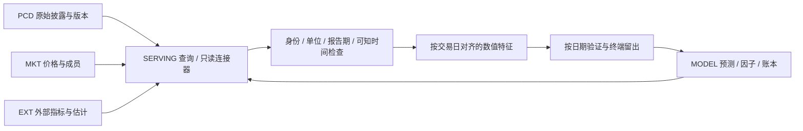
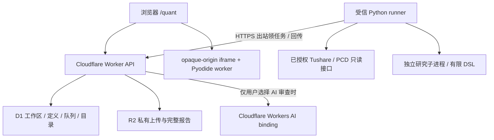

# Atlas Quant 与 Financial DB

Financial DB（FD）是四个并行逻辑库的总称，不是一张巨型因子表。逻辑边界决定事实归属、原始证据和版本；可以共用 D1/R2、连接器与查询基础设施。

| 库 | 保存什么 | v0.2 的实际连接与边界 |
|---|---|---|
| PCD · Public Company Disclosure | 公司公开披露、结构化原值、原文证据与选值版本 | 可发现 17,073 个字段，4,870 个 decimal/integer 字段具有数值资格；只读连接读取已映射记录、来源和历史选值。当前观察到 Apple 三个事实，没有 A 股已填充面板 |
| MKT · Market & Price | 价格、成交、市场属性和成员快照 | Tushare 日行情、复权、交易日历、日度估值及真实证券池快照；未证明历史成分或存活偏差已消除 |
| EXT · External Research & Estimates | 外部研究、共识、第三方整理与估计 | Tushare `fina_indicator` 的 21 项财务指标已接入。它们没有经过逐项原始公告核验；外部研报及一致预期历史序列尚未验证 |
| MODEL · Internal Calculations & Models | 内部计算、因子、预测、估值和情景 | Quant 生成因子矩阵、模型选择、预测和账本并保留 lineage；尚未验证对其他既有 MODEL 历史数据库的完整连接 |

公司自己披露的指引属于 PCD 并标记前瞻属性；分析师的预测属于 EXT；本系统预测属于 MODEL。研究推导不能覆盖 PCD 原值。供应商财务数据不能仅因名称是“财务”就自动提升为原始披露事实。

历史兼容字段名 `fd_roe` 等以及筛选键 `FD` 表示 Tushare 财务适配器；它们的逻辑归属是 EXT，不是独立的第五库。`PCD_DERIVED` 的逻辑归属是 MODEL。接口同时给出 `database` 兼容键与 `logicalStore` 时，以后者解释四库归属。

SERVING 是组合查询层，不是第五个事实库。Memory DB 保存研究方法、偏好和经验，不作为当前财务数值的事实源。PCD 的公司主体与证券上市身份也不同：一个主体可以对应多只证券，ticker 不是稳定的公司主键。

## 从目录到研究特征

字段目录描述结构、类型、单位、来源与期间规则。`numericEligible` 只表示类型可以进入数值处理；真正运行还必须有该证券和日期范围的观测、身份映射、单位与已知时间。文字、列表、引用和重复子记录不能直接强转成标量。

目录中的 `ready` 表示适配器已经实现，不保证任意证券与日期有数据。`needs_mapping` 表示需要实际记录和时点映射；`schema_only` 是该筛选值的兼容别名。原值、排名和标准化的字段配方是可审查的变换定义，不是填充历史，也不是 alpha 验证。

PCD 使用原文发布时间、获取时间、不可变观测时间、选值时间及记录创建时间的保守最大值，之后的首个交易日才可用。未知发布时间不会按报告期末回填。多个币种、重复行或同期间不同口径必须先明确选择或聚合。同证券的不同报告期可以按时点共同使用。

Tushare 财务适配器按公告日期后的首个官方交易日对齐，同公告/报告期的冲突字段隔离为缺失，并记录冲突摘要；较旧报告期的迟到更新不会覆盖已可用的新报告期。供应商历史版本是否完整仍然是数据限制。具体 schema、覆盖与真实取数验收见 [DATA_SOURCES.md](DATA_SOURCES.md)。

## 运行拓扑

D1 决定工作区所有权、策略/代码版本和任务租约；R2 保存私有大对象。runner 只执行受限研究配置，凭据由仓库外配置注入，不经浏览器或公共队列返回。完成结果先加密落入私有投递目录，再以同租约幂等回传。

浏览器 Python 是独立路径：代码及显式输入进入 opaque-origin iframe 内的 worker，可停止或超时销毁，不发送服务端凭据。它使用固定 CDN 的 Pyodide，不是服务端 Python 环境，也不是完全离线执行。输出不会自动注册成服务端可执行代码。

AI 审查是真实 `env.AI.run` 调用，可用状态依赖部署的 binding。规则检查不声称调用 AI；模型响应不声称已执行研究。补丁必须引用原代码片段，应用由用户操作。AI 可以误判，提出的研究修改仍需本地执行和独立验证。

## 证据分层

目录可发现、数值有观测、时点可用、连接器取数、数值测试、托管队列完成和前向投资效果分别记录。源码中的目录规模或一次成功请求不能替代下一层证据。当前公开材料不包含原始受限行情或完整私有研究报告。

- [API 与工作区协议](API.md)
- [研究方法与模型选择](METHODOLOGY.md)
- [数据导入、授权与保留](DATA.md)
- [部署、AI 配置与恢复](OPERATIONS.md)
